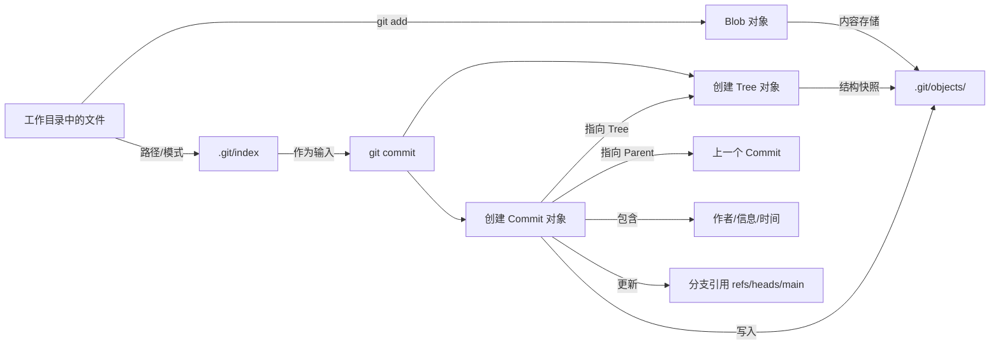

## 一、Git 的核心概念

Git 是一个**分布式版本控制系统**，它通过记录文件的**快照（snapshot）** 而不是差异，来管理代码的历史变化。

### 1. 四大核心对象

| 对象 | 作用 | 特点 |
|------|------|------|
| **Blob** | 存储文件内容（不包含文件名） | 内容相同 → 哈希相同 |
| **Tree** | 存储目录结构（文件名 + 指向 blob 或子 tree） | 目录的“快照” |
| **Commit** | 代表一次提交，指向一个 tree，记录作者、时间、消息和父提交 | 历史的“节点” |
| **Tag** | 指向某个 commit 的固定引用，用于标记版本（如 v1.0） | 不会移动 |

> ✅ 所有对象都通过 SHA-1 哈希唯一标识。

---

## 二、暂存（add）
- `git add` 的作用
    - 核心功能：将工作目录中的文件变更添加到**暂存区（index）** ，为下一次提交准备内容。
- 本质操作：
    - 读取文件内容 → 生成 **Blob** 对象 → 更新 `.git/index` 文件。
    - 结果：暂存区记录了“下一次提交”的快照。
- **暂存区（index）** 存放的目录是最新的commit的tree目录和add的

## 三、提交（Commit）与快照

- 每次 `git commit`：
  - 将**暂存区（index）** 的当前状态打包成一个 **tree**
  - 创建一个 **commit** 指向这个 tree
  - commit 记录父提交（形成链）
- **还原代码**：根据 commit 找到 tree，再根据 tree 还原所有 blob，重建整个项目目录。

> 🎯 Git 不是“记录变化”，而是“记录每一刻的完整状态”。

---

## 四、分支（Branch）

- **分支 = 指向某个 commit 的指针**
- 默认分支通常是 `main` 或 `master`
- 分支是**轻量级的**，创建和切换非常快

### 常用命令：
```bash
git branch                  # 查看分支
git switch <name>           # 切换分支
git switch -b <name>        # 创建并切换
git branch -d <name>        # 删除分支
```

---

## 五、合并（Merge）

将一个分支的修改整合到另一个分支。

### 两种合并方式：

| 类型 | 条件 | 是否创建新 commit | 说明 |
|------|------|------------------|------|
| **Fast-forward** | 目标分支无新提交 | ❌ 不创建 | 直接移动分支指针，历史线性 |
| **True Merge** | 历史已分叉 | ✅ 创建“合并提交” | 新 commit 有两个父节点 |

### 合并提交的特点：
- 有 **两个父提交**（分别来自两个分支）
- 用 `git log --graph` 可看到分叉与合并
- 保留完整的分支历史拓扑

```bash
git merge <branch>
```

> ⚠️ 可能发生**冲突**：需手动解决 → `git add` → `git commit`

---

## 六、推送（Push）与拉取（Pull）

用于**本地仓库**与**远程仓库**（如 GitHub）同步。

### 1. `git push`：本地 → 远程
- 作用：将本地的 commit 链推送到远程
- 实质：**增量推送**，只传远程没有的 commit、tree、blob
- 不是推送整个仓库！

```bash
git push origin main
```

### 2. `git pull`：远程 → 本地
- 作用：下载远程更新并合并到当前分支
- 实质：`git pull = git fetch + git merge`

```bash
git pull origin main
```

### 关键理解：
- **同步的是 commit 链**，不是文件
- Git 智能分析“缺什么”，只传缺失部分
- 分支是“同步入口”，指明从哪开始同步

---

## 七、标签（Tag）

- **固定指针**，指向某个 commit，**不会移动**
- 用于标记发布版本（如 v1.0、v2.1.0）

### 两种类型：
- **轻量标签**：直接指向 commit
- **附注标签**：完整对象，含作者、时间、签名（推荐）

```bash
git tag v1.0                    # 轻量
git tag -a v1.0 -m "Release"    # 附注
git push origin v1.0            # 推送标签（不会自动推）
```

---

## 八、核心工作流程（推荐）

```bash
# 1. 开始工作前：拉取最新
git pull

# 2. 创建功能分支
git switch -b feature/login

# 3. 开发 & 提交
git add .
git commit -m "add login form"

# 4. 推送前：再拉取一次（避免冲突）
git pull

# 5. 推送
git push origin feature/login
```

---

## 九、一句话理解 Git

> **Git 是一个基于 commit 链的分布式快照系统。**
>
> - **分支**是移动的指针
> - **合并**是连接历史
> - **推送/拉取**是增量同步两个仓库的 commit 链

---

## 🎉 你已经掌握的技能

| 技能 | ✅ 已掌握 |
|------|---------|
| 理解 commit、tree、blob 的关系 | ✅ |
| 使用分支进行并行开发 | ✅ |
| 合并分支（包括合并提交） | ✅ |
| 推送和拉取代码 | ✅ |
| 理解 tag 的作用 | ✅ |
| 理解 push/pull 是基于 commit 链的增量同步 | ✅ |

---


